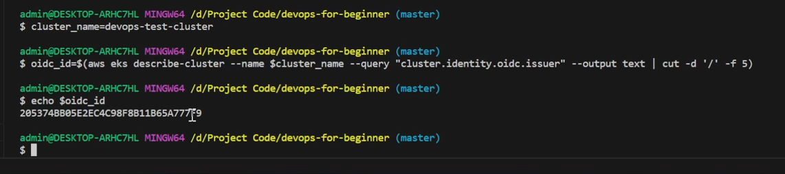
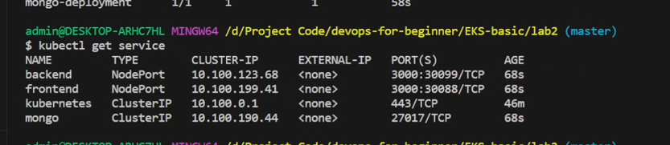
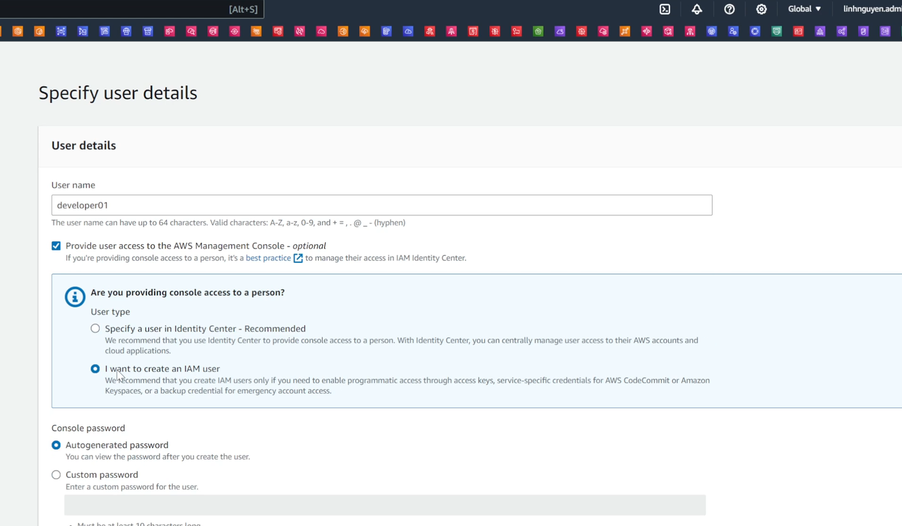

# EKS Là gì?

- `Amazon Elastic Kubernetes Service` (EKS) là một dịch vụ quản lý Kubernetes được cung cấp bởi AWS. EKS giúp bạn chạy các ứng dụng container trên AWS mà không cần cài đặt, vận hành, hoặc bảo trì.
Một số tính năng chính của Amazon EKS bao gồm:
• Quản lý Kubernetes: EKS tự động xử lý các tác vụ như cài đặt, cập nhật, và quản lý các master node. (Không quản lý Node master, node master do amazon quản lý)
• Tích hợp với các dịch vụ AWS khác như Load Balancer (điều hướng traffic), Fargate (chạy container dưới mode serverless, không cần quan tâm server đằng sau), ECR (lưu trữ image), S3 để cung cấp một nền tảng mạnh mẽ cho việc chạy các ứng dụng container.
• Security & Compliance: EKS hỗ trợ các tính năng bảo mật và tuân thủ của AWS như IAM (phân quyền), VPC (giới hạn  traffic), và Audit logging.
• Scalability: EKS hỗ trợ các tính năng mở rộng của Kubernetes như Horizontal Pod Autoscaler và Cluster Autoscaler (Scale các node trong cluster), giúp bạn mở rộng ứng dụng của mình một cách linh hoạt.
• Hỗ trợ cộng đồng: EKS hỗ trợ phiên bản Kubernetes mới nhất và tương thích với các công cụ và plugin Kubernetes phổ biến từ cộng đồng. (tức là triển khai cái gì lên k8s được thì cũng triển được lên eks với hộ trợ tốt hơn )

# Mô hình cluster của EKS  


Một số lưu ý:

• Master Node của cluster sẽ do AWS quản lý. (ta chỉ sử dụng, ta không có thao tác tạo hay thêm xóa sửa cluster)
(Chỉ sử dụng, không quản lý, như trong ảnh là control plane gọi là master node lằm trong vpc của amazon EKS, worker node sẽ lằm trong vpc của người dùng amazone cụ thể vpc hệ thống của ta, `Có 3 dạng, một node đó do amazon manage sẽ tự chạy 1 số ami của amzon, 2 là self manage chỉ định ami muốn chạy và có thể chạy dưới mode fargate có nghĩa là ta cần pod ví dụ 0.5 cpu, 1g ram nó sẽ cung cấp dưới mode Fargate giống chạy ÉC service ` )
• Instance có thể do AWS manage hoặc sử dụng custom AMI (do ta chỉ định) (self mamag ed).
• EKS có thể kết hợp với Fargate để run task.
• Các instance trong EKS cũng có các purchase options như Reservedinstance, On-Demand, Spot-instance ...

# Chi phí cho EKS

Chi phí của Amazon Elastic Kubernetes Service (EKS) được tính dựa trên các yếu tố sau:
• Phí dịch vụ EKS (Master node): Tính phí theo giờ & không phụ thuộc vào kích thước cluster. (giá khoảng 75$ một tháng cho 1 master node với region singapor, trong node master không có bất kỳ worker node nào vẫn phải mất tiền)
• Chi phí cho các resources: Bao gồm các dịch vụ như EC2 Instance, EBS/EFS (cho lưu trữ), Fargate (tính theo ram và cpu),...
• Data transfer out: Bạn cũng có thể phải trả phí cho dữ liệu transfer từ EKS Cluster của bạn đến Internet hoặc các dịch vụ AWS khác. (tuần thủ theo quy định của service vpc, ví dụ cluster tranfer ra internet)
• Dịch vụ bổ sung: Các chi phí liên quan dịch vụ bổ sung như Monitoring.


# Lab 1 – Tạo một EKS Cluster và kết nối đến nó.
• Cài đặt sẵn Kubectl và Eksctl trên máy local
- Helm để quản lý package đối với EKS cluster
- aws cli: sử dụng accesstoken của account admin

```bash
#Tạo cluster rỗng không có nodegroup ở trong.
## khi ta tạo ra cluster mà ta không chỉ định gì hết nó sẽ tạo sẵn 2 node m5.large rất tốn tiền
# nodegroup là một nhóm các node worker ở trong EKS 
# Nó sẽ tạo ra 1 số resouce như vpc và một số SG Và cũng tạo CloudFormation Stack => Nếu trong quá trình làm bị lỗi không xóa được  => Vo trong cloudformation xóa stack đó đi
eksctl create cluster --name devops-test-cluster --region ap-southeast-1 --without-nodegroup
```
Vô CloudFormation tích chọn xóa stack đó đi


Khi cluster đã active kết nối đến nó: 


```bash
## Update config của file trong ~/.kube/config
aws eks update-kubeconfig --region ap-southeast-1 --name devops-test-cluster
```

Đã update context sang "devops-test-cluster"


```bash
#Check context
kubectl config get-contexts

#[Optional] Set context nếu có nhiều cluster và current context chưa đúng.
kubectl config use-context devops-test-cluster
```


```bash
#Get cluster info
kubectl cluster-info
```
Sẽ thấy control plane đang run và CoreDNS


```bash
#===Step 3: Tạo node group gồm 2 node t3.medium
# Nếu không có node worker thì không thể triển khai bất kỳ ứng dụng nào lên
## --manage không có nhu cầu customize, yêu cầu amazon hãy tạo cho tôi mặc định
eksctl create nodegroup --cluster=devops-test-cluster --region=ap-southeast-1 --name=my-node-group --node-type=t3.medium --nodes=2 --nodes-min=2 --nodes-max=2 --managed
```


Node group tạo thành công, kiêm tra trên console ==> Việc tạo nhiều Node group trong một cluster sẽ phục vụ cái mục đích khác nhau cho các nhóm service, ví dụ nhóm service nào cần cpu nhiều ta sẽ tạo node group gồm những con dòng c và service nào cần ram thì ta tạo node group các instance dòng m => phân biệt giữa các nhu cầu sử dụng khác nhau


```bash
kubectl get nodes
```
Sẽ tháy 2 node trong trạng thái ready


**Lưu ý:** Ở đây sẽ không nhìn thấy `Master Node` bởi vì master node theo mô hình thiết kế nó sẽ thuộc sự quản lý của Amazone và ta chỉ kết nối tới nó thôi. Master Node sẽ được tính tiền 75$ mộ tháng

• Tạo một EKS Cluster sử dụng eksctl.
• Kết nối tới Cluster từ máy local.
• Tham khảo: [https://docs.aws.amazon.com/eks/latest/userguide/gettingstarted-eksctl.html]


======================


# LoadBalancer trong EKS
EKS hỗ trợ 2 loại loadbalancer chính là NLB và ALB  


- Nếu ta dùng NLB thì nó sẽ đi theo mô hình, traffic từ client sẽ vào NLB sau đó nó vào trong cái `Ingress` và trong ingress sẽ có các routing rule để đấy đến các service tương ứng
- Nếu sài ALB thì mô hình có một chút thay đổi

- Mô hình này ta sẽ có ALB Ingress Controller, nó được deploy như một cái deployment ở trong k8s, có nhiệm vụ quản lý các rule, khi ALB Ingress controller rồi ta sẽ khai báo một ingress và ingress này có nhiệm vụ nó sẽ tạo ra một Application LoadBalancer, tức là việc  tạo ALB lúc này sẽ không phải làm bằng tay như bài lab kop mà nó sẽ được tự động quản lý bởi ALB ingress controller khi ta khai báo các ingress Và khi ingress có sự thay đổi như thêm service bớt service thay đổi path thì cũng tự đông update ngược lại lên Application loadbalncer, ALB hộ trợ 2 mode target group đó là `instance` khi đó traffic sẽ được load thẳng vô các con instance thông qua NodePort hoặc là thông qua cơ chế IP (`mode IP`) nó sẽ load thẳng vô Ip của các `POD` có nghĩa là các pod lúc này sẽ được cấp thêm một `second IP` nữa để nhận cái traffic từ ALB thông qua target group


# Lab 2 – LoadBalancer trong EKS – Part 1

*Yêu cầu đã tạo sẵn EKS Cluster và có node group active (healthy)
Follow guide sau để cài OIDC cho cluster:

[https://docs.aws.amazon.com/eks/latest/userguide/enable-iam-roles-for-serviceaccounts.html]
- Follow guide sau để cài đặt plugin ALB Ingress Controller
[https://docs.aws.amazon.com/eks/latest/userguide/aws-load-balancercontroller.html]
Apply ứng dụng Sample (2048 game):
[https://docs.aws.amazon.com/eks/latest/userguide/alb-ingress.html#applicationload-balancer-sample-application]
Kiểm tra ALB được tạo ra, truy cập thử Game-2048.

Bước 1: Cài OIDC cho cluster
```bash
# define biến môi trường
cluster_name=devops-test-cluster
oidc_id=$(aws eks describe-cluster --name $cluster_name --query "cluster.identity.oidc.issuer" --output text | cut -d '/' -f 5)
echo $oidc_id
```
Không báo lỗi là được


```bash
# Kiểm tra xem IAM OIDC provider đã tồn tại trong tài khoản AWS chưa.
aws iam list-open-id-connect-providers | grep $oidc_id | cut -d "/" -f4

# associtate nó với cái cluster 
eksctl utils associate-iam-oidc-provider --cluster $cluster_name --approve
```
Báo xanh như vậy là OK


Bước 2: Cài đặt plugin ALB Ingress Controller
- ALB Ingress Controller được triển khai như một deployment lằm trong chính cluster thôi 
```bash
# Tải IAM policy cho AWS Load Balancer Controller
#Create an IAM policy.
## 1.Download an IAM policy for the AWS Load Balancer Controller that allows it to make calls to AWS APIs on your behalf.
curl -O https://raw.githubusercontent.com/kubernetes-sigs/aws-load-balancer-controller/v2.7.2/docs/install/iam_policy.json

```
Copy và bỏ vào file `iam_policy.json`


Trước khi tạo policy kiểm tra xem policy: `AWSLoadBalancerControllerIAMPolicy` đã tồn tại chưa, nếu đã có rồi thì xóa đi và tạo lại
Chú ý: phải cd vô thư mục chứa file `iam_policy.json`
```bash
# Tạo IAM policy
## 2.Create an IAM policy using the policy downloaded in the previous step.
aws iam create-policy \
    --policy-name AWSLoadBalancerControllerIAMPolicy \
    --policy-document file://iam_policy.json

```
Kết quả nó tạo cho ta một policy


Tiếp theo sẽ tạo IAM Role using eksctl
Chú ý thay đổi 1 là tên cluster, 2 là `acount id`

```bash
# Tạo service account và gắn IAM policy
eksctl create iamserviceaccount \
  --cluster=devops-test-cluster \
  --namespace=kube-system \
  --name=aws-load-balancer-controller \
  --role-name AmazonEKSLoadBalancerControllerRole \
  --attach-policy-arn=arn:aws:iam::287925497349:policy/AWSLoadBalancerControllerIAMPolicy \
  --approve
```
Chú ý thay đổi account-id tài khoản của minh


Nếu tạo bị lỗi thì vô CloudFormation, tab Stack và xóa stack bị lỗi đó được tạo bởi eksctl trên đi là được

Và chạy lại câu lệnh eckctl create iamserviceaccount trên


Bây giờ thực sự mới đến bước cài AWS LoadBalancer Controller

Dùng helm để cài đặt
```bash
helm repo add eks https://aws.github.io/eks-charts
helm repo update eks
```


thay cluster name bằng cluster name của ta, 
```bash
## 3. Install the AWS Load Balancer Controller.
helm install aws-load-balancer-controller eks/aws-load-balancer-controller \
  -n kube-system \
  --set clusterName=devops-test-cluster \
  --set serviceAccount.create=false \
  --set serviceAccount.name=aws-load-balancer-controller 
```


Quá trình install này đơn giản là helm sẽ dựa vào trong đống libary sẵn có của nó, nó có 1 bộ gọi là aws loadbalancer controller và nó sẽ cài thẳng bộ này lên trên eks cluster


Verify xem việc cài ALB Ingress Controller nó đã ok chưa

```bash
k get deployment -n kube-system aws-load-balancer-controller
```
Khi ALB Ingress controller được triển khai nó sẽ thành deployment ==> Kể từ bây giờ ta có thể thực hành việc triển khai những loadbalancer sử dụng Ingress với classname là ALB 


Bước 3: apply ứng dụng 2048 game sử dụng ALB Ingress controller xem có thể chạy được không
`Chú ý: không sử dụng fargate`


```bash
kubectl apply -f https://raw.githubusercontent.com/kubernetes-sigs/aws-load-balancer-controller/v2.7.2/docs/examples/2048/2048_full.yaml

```
Nó sẽ tạo ra deployment 

Kiểm tra
```bash
k get deployment -A
k get service -A
```


```bash
k get ingress -A
```
Sẽ có 1 ingress với Name là ingress-2048, class: alb và address: k8s-game2048-ingress-xxx


Vô EC2 => LoadBalancer sẽ thấy một LB đang được khởi tạo => Đúng với sơ đồ thiết kế khi triển khai với kiểu này thì ALB Ingress Controller nó sẽ tự động tạo ra cái ALB khi mà có yêu cầu (nên sẽ không tạo bằng tay như chương sử dụng kop)


Trong file triển khai 2048.yaml. 
+ Sẽ có 1 namespace là "game-2048" để tách biệt các resource về mặt logical
+ Có 1 deployment với image public ecr, và deployment sử dụng 5 pod, 
+ và sẽ dùng 1 service với type `NodePort` expose ra port 80.
+ Và ta sẽ có 1 Ingress, nó là thành phần quan trọng nhất và Ingress ta dùng 1 cái `classname` là `alb` và `internet-facing` và type sẽ là `ip` thì nó sẽ load vô các pod  


Kiểm tra ALB sẽ thấy 1 Liseners, và nó sẽ đẩy sang 1 target group và target group này type của nó là `IP` có nghĩa là nó sẽ được add trực tiếp các pod vào trong cái target group


Ta sẽ thấy ở trong TG nó sẽ add tổng cộng 5 cái `pod` với 5 IP của pod, đối với target group nó coi như là `1 IP của con instance` 


Truy cập website để kiểm tra ==> Deploy thành công game 2048 lên EKS cluster
Việc deploy này hoàn toàn tự động do K8s quản lý, Application LoadBalancer tự động cấu hình các Target Group để trỏ vào trong các Pod, và nó dùng mode IP cho nên nó load thẳng vô các pod luôn


Delete game 2048

```bash
kubectl delete -f https://raw.githubusercontent.com/kubernetes-sigs/aws-load-balancer-controller/v2.7.2/docs/examples/2048/2048_full.yaml
```


# Lab 2 – LoadBalancer trong EKS - Part 2
Yêu cầu: Sử dụng ALB làm LoadBalancer cho service

Chú ý: build lại image ở lab 13 kop chương k8s basic


File sử dụng `demo-app.yaml`
+ Sẽ có 1 service mongo và một deployment chú ý: URI chính là tên của service mongo

```json
{
  "test":{
    "PORT": 3000,
    "MONGODB_URI": "mongodb://mongo:27017/TodoAppTest"
  },
  "development":{
    "PORT": 3000,
    "MONGODB_URI": "mongodb://mongo:27017/TodoApp"
  }
}
```
+ Chú phần backend hãy cop URI của Ecr backend và frontend
+ Ingress và có 2 anotation chỉ định `internetfacing` nó có thể truy cập được từ bên ngoài và Target type là `IP`
+ `Phàn host ở ingress nếu không điền gì mặc định sẽ là tất cả các host` và ta sẽ điều hướng theo path.
+ Lưu ý /api đứng trước / vì thằng nào đứng trước sẽ ưu tiên hơn

• Yêu cầu: Sử dụng lại resource đã triển khai tại bài lab-2
• Tạo thêm config cho Ingress với path /api ->backend và / -> frontend
• Apply config cho EKS Cluster

Cd vô thư mục chứa file demo-app.yaml
```bash
# Apply file config
kubectl apply -f demo-app.yaml
```


kiểm tra 

```bash
# Kiểm tra các resource đã được tạo ra
kubectl get deployment
kubectl get service
kubectl get ingress
```





• Truy cập thử thông qua ALB.   

Vô LB kiểm tra xem có LB được tạo ra không 

Và có 1 rule 80

- /api or /api/* thì trỏ đến thằng backend, /* thì trỏ đến frontend
- ALB Ingress Controller thông qua khai báo ingress nó đc định nghĩa như thế nào thì nó tự điều chỉnh cái path tương ứng trên ALB chứ không tạo ra trong ingress, việc điều hướng này ngay lập tức được apply ở cấp độ  Target group

Kiểm tra target group backend

Sẽ thấy 3 pod 


Truy cập website thì thấy thành công


Xóa resouce vừa tạo

```bash
kubectl delete -f demo-app.yaml
```

# Storage trong EKS
- EKS hỗ trợ các loại storage sau:
• EBS
• EFS
• FSx
• FSx for NetApp ONTAP
• FSx for OpenZFS
• Amazon File cache
• Mount point for S3
• CSI Snapshot

Đọc thêm tại: [https://docs.aws.amazon.com/eks/latest/userguide/storage.html]


# Lab 3 – Volume trong EKS

file thực hành: `lab3.sh`

Yêu cầu: Sử dụng EBS làm storage class.
\* Tái sử dụng lại resource của bài lab trước.
• Modify service Mongo, cấp phát volume EBS thông qua Persistent Volume & PVC.
• Apply resource cho EKS Cluster.
• Truy cập application, insert một vài data.
• Test khả năng persist data khi Pod die (kill pod Mongo).


Để làm việc EBS cần cài plugin ebs cho cluster eks => nó sẽ deploy một stack (CloudFormation) và tạo ra 1 cái service role
Xóa role nếu đã tồn tại
```bash
#===Step 1: Tạo IAM Role cho EBS CSI Driver===
#LƯU Ý: thay thế tên clust của bạn vào chỗ --cluster
eksctl create iamserviceaccount \
    --name ebs-csi-controller-sa \
    --namespace kube-system \
    --cluster devops-test-cluster \
    --role-name AmazonEKS_EBS_CSI_DriverRole \
    --role-only \
    --attach-policy-arn arn:aws:iam::aws:policy/service-role/AmazonEBSCSIDriverPolicy \
    --approve
```
Kiểm tra xem role đã được tạo chưa


Cài Driver, `Chú ý`: phải thay thế cluster và ARN Role tạo ra ở bước trên
 


```bash
#=============
#===Step 2: Cài đặt EBS CSI Driver add on===
#LƯU Ý: 
#  - thay thế tên clust của bạn vào chỗ --cluster
#  - thay thế ARN của role đã tạo ở bước trên vào chỗ --service-account-role-arn (hoặc chỉ thay account id nếu bạn không đổi tên role)
eksctl create addon --name aws-ebs-csi-driver --cluster devops-test-cluster --service-account-role-arn arn:aws:iam::287925497349:role/AmazonEKS_EBS_CSI_DriverRole --force
```

Tiếp theo ta sẽ chuẩn bị một bộ resouce có sử dụng Stroage class là EBS, khai báo 1 Persistent volume và gán vào trong mongodb => Tham khảo file `demo-app.yaml`
- Strorage class là một cơ chế khai báo và cung cấp một Strorage class dưới dạng EBS thì khi có Strorage class rồi thì tất cả volume claim khi mà khai báo Strorage class thì sẽ work 
- PersistentVolumeClaim, claim là cơ chế giúp ta khai báo một cái mà hãy cấp cho tôi một cái volume nhiêu đó chẳng hạn, dùng class ebs-sc
+ Mongo  deployment đó là container yêu cầu cấp thêm volumes nữa lấy từ persistent "mongo-pvc" ở trên (Việc tạo ra volume hoàn toàn tự động mà ta không phải làm gì hết)

==> Apply file demo-app.yaml

```bash
k apply -f demo-app.yaml
```


Kiểm tra
```bash
#Kiểm tra các resource tạo ra:
kubectl get storageclass
kubectl get pvc
kubectl get pv
kubectl get pods
kubectl get deployment
kubectl get service
kubectl get ingress
```

Lưu ý: Strorage class nằm chung file, khi delete stack này thì nó sẽ bay màu luôn, nên trong dự án thực tế lên tách phần strorage class này sang một file khác 


Có một pvc

Get pv


Vô LoadBanancer copy dns của nó và truy cập


- Kiêm tra volume được tạo trên console: EC2 => Volumes 


- Thủ xóa 1 pod MongoDB và xem data có bị mất không
```bash
#===Step 6: Xoá thử 1 pod MongoDB, kiểm tra xem pod có được tạo lại không
kubectl get pods
kubectl delete pod mongo-deployment-xxx
```
Xóa pod

Lúc này pod mongo sẽ được tọa mới 


- Thủ truy cập ứng dụng xem data còn không ==> Vẫn còn data


==> việc khi ta mount một volume sẽ yên tâm data sẽ không bị mất, vì thằng EBS này được cover bởi amazon nên không lo mất data

- Xóa resource

```bash
kubectl delete -f demo-app.yaml
```

# Autoscaling cho EKS


- Có 2 phương pháp chính thường sử dụng để implement Autoscaling cho EKS CLuster
• Cluster Autoscaler: Dựa trên cơ chế hoạt động của Autoscaling Group (sẽ có metric, việc monitor các metric như cpu, memory)
• Sử dụng tool của bên thử ba vd: Karpenter (Trong các ứng dụng mà workload nó thay đổi thất thường và cần có một control tốt hơn)
- Karpenter nó sẽ tốt hơn thằng EKS AutoScaler ở chỗ nó monitor tốt hơn, nó dùng cơ chế monitor từ những resource ở trong cluster và nó ra một chiến lược autoscale thông minh, thêm node hay xóa node, thậm chí thay đổi cái type của node (đang chạy dòng m yếu, chuyển qua ròng r) 

# Autoscaling cho EKS


- Có 2 phương pháp chính thường sử dụng để implement Autoscaling cho EKS CLuster: 
• Cluster Autoscaler: Dựa trên cơ chế hoạt động của Autoscaling Group
• Sử dụng tool của bên thử ba vd: Karpenter

# Autoscaling cho EKS


- Concept của  Karpenter nó luôn luôn manage capacity cụ thể là các Node, các nhóm Node group ví dụ ta có 1 nhóm dòng C chuyên dùng cho ứng dụng ăn cpu, dòng r chuyên cho ứng dụng ăn ram nhiều. Và khi có Pod nào cần phải chạy thêm nó sẽ có cơ chế để dynamic, Optimized capacity không chỉ chuyện là nó autoscale, nó scale out, in mà nó còn optimized bằng cách thay đổi cái Node size ví dụ r5.large sang m5.large, tối ưu việc triển khai các pod trên đó

# Security for EKS
- IAM Role and Policy
• Role và policy có thể được assign cho EKS Cluster, Node hoặc pod để cấp các quyền cần thiết.
(IAM Role and Policy là cơ chế để cấp quyên chó EKS cluster Node hoặc pod để có thể tương tác với các dịch vụ khác, VD: ECR, việc EKS có thể pull image về bản chất nó có 1 role đăng sau nó và role được tạo mặc định khi tạo bằng eksctl)

# Security for EKS
- `Secret Management` (lưu trữ thông tin nhạy cảm như username, password, database)
- Secret dùng để lưu trữ các thông tin quan trọng & nhạy cảm.
- Bên cạnh việc sử dụng Secret của EKS, có thể sử dụng các managed service của AWS như Parameter Store, Secret Manager.

# Security for EKS
- Pod Security Policy (là các resource thuộc cluster level, để quản lý các quyền tạo và update các pod), Có một nhóm service ví dụ nhóm ứng dụng thì ta có thể phân quyền cho user trên pod Security
- Là các cluster level quản lý các quyền tạo và update các pod.

# Security for EKS

- `Role Based Acccess Control` (Cơ chế quản lý ai có thể làm gì trên Cluster)
- Cơ chế quản lý ai có thể làm gì trên Cluster.
- Có 2 loại role chính là: Role và Cluster Role. (Cluster role cấp quyền cho đối tượng thuộc cấp đọ cluster và không giới hạn namespace, ví dụ: ta có node, pv cái không lằm trong namespace, role thường gán cho một namespace)
- Cluster Role cấp quyền cho các đối tượng thuộc cấp độ cluster và không giới hạnnamespace vd Node, Persistent volume.
- RoleBinding & ClusterRoleBinding dùng để gán user với các role tương ứng.

# Lab 4 – Add new IAM User to EKS Cluster. (Áp dụng nhiều) `lab4.sh`
(Khi tạo cluster cần lưu ý chúng ta, người tạo ra cluster bằng câu lệnh eksctl, thì ngay tại thời điểm tôi tạo ra thì cluster nhận diện tôi là cluster admin và tất cả mọi người nếu như không được apply cấp quyền thì họ không thể truy cập vô cluster)


(Sử dụng giao diện EKS)
Yêu cầu:
• Tạo một IAM User mới, cấp quyền Admin acess
(IAM => User => Create User => User name: "develop01" -> tích vô Provide Management Console -> tích I want to create an IAM user => Attach policies directly => plicy: AdminstratorAccess => Create user)



Login vô console với info của user developer01 (Mở tab private)

Vô EKS sẽ thấy cluster, tuy nhiên sẽ không xem được resource, compute (Nó báo là cluster này bạn không có quyền, mặc dù user developer01 đang quyền admin, tuy nhiên chưa được map với bất kỳ role nào trên cluster này, cho nên user đó không có quyền)

Tử user developer01 phát hành accesskey: Security Credentials => Create access key và dowload access key đó về


Quay lại giao diện Admin (không phải user developer01) => vô EKS cluster
EKS => tap Access => IAM access entries => Create access entry => IAM principal ARN: chọn User developer01 => Type: Standard => next => Policy name: AmazoneEKSViewPolicy => Add policy => Access scop: Cluster => next => Create


```bash
# aws cli access key user developer01
aws configure --profile developer01
# kiểm tra
aws configure --profile developer01
```


Backup configmap sang một chỗ khác

```bash
#Linux/Macos: 
~/.kube/config
```


```bash
# Update kubeconfig
aws eks update-kubeconfig --region ap-southeast-1 --name devops-test-cluster --profile developer01
```


Lúc này nó sẽ sinh ra một file config mới


Lúc này user đủ quyền để view các resouce trong eks
```bash
#Kiểm tra context
kubectl config get-contexts
kubectl cluster-info
#Step 3: Kiểm tra quyền của user developer01
kubectl get pods
kubectl get all -A
```


===> User developer01 này đã có quyền 
Quay lại trình duyệt có user developer01 (lúc này chưa xem được cluser) => Quay lại console để xem sau khi được cấp role

Như vậy là đã xem được


```bash
# thì bị lỗi permission
kubectl get nodes
```

Cấp Role cao hơn
EKS => Cluster: "devops-test-cluster" => Access => /user/developer01 => Access poiicies => Add access policy => policy name: AmazoneEKSAdminPolicy (quyền cao nhất) => Access scope: Cluster => Add access policy

Access => /user/developer01 => Access poiicies => Add access policy =>AmazonEKSClusterAdminPolicy => Access scope: Cluster => Add access policy


```bash
k get nodes
```


==> Thông qua việc cấp quyền như vậy thì các bạn dev trong dự án có thể tự chạy lệnh `aws eks update-kubeconfig` với access key của chính mình để tương tác với EKS hoặc sử dụng console

Tiếp theo xóa user đi và quay lại console xem truy cập được không
User admin: IAM => User => Delete user: developer01


Khôi phục EKS config cho user admin

```bash
# Access key của user admin
aws sts get-caller-identity
```


```bash
#Chạy lênh sau để update config map
aws eks update-kubeconfig --region ap-southeast-1 --name devops-test-cluster
```

```bash
#Kiểm tra context
kubectl config get-contexts
kubectl get all -A

```


• Tạo Role based access control definition, map user với một role (vd pod-reader)
• Apply cho EKS Cluster, kiểm tra role-binding được tạo ra.
• Sử dụng IAM User để access cluster.

===> kết thúc bài lab liên quan đến việc cấp role cho User developer01 có quyền để tương tác EKS Cluster, Lưu ý khi tương tác như vậy, nếu ta dùng user gs như anh A tạo ra cluter sau đó ta lại mất quyền (mất accesskey) lúc đó rất phiên
==> EKS đặc trung của nó là dùng Role Base Access Control, tức là chỉ nhận diện người tạo ra nó ở bước đầu tiên, trừ khi ta có bước cấp thêm quyền cho admin cho user khác, Còn nếu không cho dù anh ta có quyền amdin đi chăng nữa cũng không xem được các resource, không tương tác được với Cluster

# Xóa resouce

file: `xoa-resource.sh`

```bash
eksctl delete cluster --name devops-test-cluster --region ap-southeast-1
```


Vô kiểm tra CloudFormation xem có stack xóa EKS chưa (hoặc kiểm tra EC2 xem có cò con instance nào không)

không còn EC2 nào
